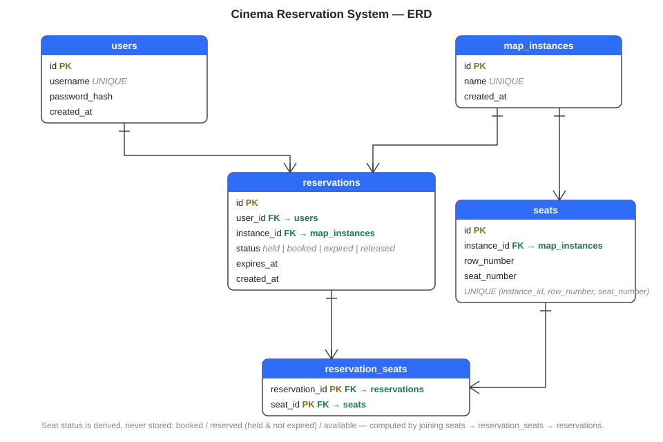

# Cinema Reservation System

A full-stack cinema seat reservation app. Authenticated users see a live seating map, hold seats for 15 minutes, adjust their selection, and complete a booking. Seat state updates propagate to every connected viewer in real time; selection rules (consecutive seats, no trapped single seat) are enforced server-side inside row-locked transactions.

**Stack:** React + TypeScript (Vite, styled-components) · Node.js + Express + TypeScript · PostgreSQL · WebSockets (`ws`) · Docker Compose (nginx serves the frontend and proxies the API, so cookies stay first-party).

## Quick start

```bash
docker compose up --build
```

Then open **http://localhost:8080**. To see the real-time behavior, register two different users in two browsers (or one normal + one private window), open the same map instance in both, and reserve seats in one — they turn orange in the other instantly. Booking turns them red. Holds expire after 15 minutes and the seats free up live.

## Development mode

The repo is a pnpm workspace — one install and one command run both apps:

```bash
docker compose up -d db          # just Postgres
pnpm install
pnpm dev                         # backend on :4000 (migrates + seeds on boot) + Vite on :5173, proxying /api
```

Or run either package on its own with `pnpm dev` inside `backend/` or `frontend/`.

## Tests

```bash
pnpm test                        # both packages; backend integration tests need the db container up
```

Frontend tests (selection rules, countdown) are pure and need no services.

The backend suite includes concurrency race tests: two clients fighting over the same seats, two clients jointly creating a trapped seat, and a book/reserve interleaving that proves the wall-clock expiry check.

Most backend tests intentionally run against a real Postgres rather than mocks: what they verify — row-lock blocking, statement-snapshot visibility, `clock_timestamp()` expiry, `pg_notify` delivery-on-commit — only exists in a real database. A mocked driver (or an in-memory emulator) has none of those mechanics, so a green suite would prove nothing. Pure logic stays in DB-free unit tests; in CI the database would be a service container using the same image.

## API

All routes under `/api`. Errors always use the envelope `{ "error": string, "code": string }`.

| Method | Path | Purpose | Key errors |
|---|---|---|---|
| POST | `/api/auth/register` | Create user, auto-login (httpOnly cookie) | 400 `INVALID_INPUT`, 409 `USERNAME_TAKEN` |
| POST | `/api/auth/login` | Login, sets cookie | 401 `INVALID_CREDENTIALS` (identical body whether user exists or not) |
| GET | `/api/auth/me` | Current user | 401 |
| POST | `/api/auth/logout` | Clear cookie | — |
| GET | `/api/map-instances` | List map instances (metadata only) | 401 |
| POST | `/api/reservations` | Create a held group `{instanceId, seatIds}` → `{reservationId, expiresAt, seatIds}` | 400 `NOT_CONSECUTIVE` / `DIFFERENT_ROWS` / `TRAPPED_SEAT`, 409 `SEAT_TAKEN` / `ACTIVE_GROUP_EXISTS` |
| PATCH | `/api/reservations/:id/seats` | Replace the group's seat set (resets the 15-min window) | 403 `FORBIDDEN`, 410 `EXPIRED`, + the rule errors above |
| DELETE | `/api/reservations/:id` | Release the group | 403, 410 |
| POST | `/api/reservations/:id/book` | Book exactly the held group (idempotent) | 403, 410 `EXPIRED` |

Password policy: at least 6 characters with an uppercase, a lowercase, and a digit. Passwords are bcrypt-hashed.

## Real-time protocol

Connect to `ws://<host>/api/ws?instanceId=<id>` (the auth cookie rides the handshake).

- **Server → client:** `{type:"snapshot", seq, seats, myReservation}` on connect and on request; `{type:"delta", seq, seats, myReservation}` after any change (full recomputed seat list); `{type:"ping", seq}` every 5 s.
- **Client → server:** `{type:"pong"}` (liveness), `{type:"sync"}` (request a fresh snapshot).
- Every seat carries `status` (`available` / `reserved` / `booked`) and `mine`. User identity is never sent to clients, and a hold's expiry timestamp is only visible to its owner.
- `myReservation` (`{id, seatIds, expiresAt}` or `null`) is the requesting user's active held group, restated on every message — so every tab of the same user shares one group: any tab can extend, book, or reset it, and all tabs see it change live.
- `seq` is a per-instance monotonic counter. If a client sees a gap — or a ping whose `seq` doesn't match — it requests a snapshot. So a lost message costs at most ~5 seconds of staleness, never correctness.
- Holds expire lazily (queries treat lapsed holds as free instantly — availability never waits on anything). Visibility of expiry is two-tier by design: the holder's own tabs send a `sync` cue when their countdown lapses (the server flips the hold under a guarded UPDATE and broadcasts, so all viewers update within milliseconds), while for holds whose owner is gone a background sweeper flips and broadcasts every 30 s — an accepted worst-case display delay, never a booking delay.

## Design decisions

**Whole-row locking.** Reserving seats locks the entire physical row (`SELECT … FOR UPDATE` over the row's seats, one ordered statement) rather than just the selected seats. The trapped-seat rule depends on *neighbors outside the selection* — with per-seat locks, two concurrent valid-alone reservations can jointly trap a single empty seat. Rows serialize independently, so throughput scales per row, and a row's lifetime write volume is bounded by its seat count — the queue is self-limiting.

**Reservation groups, book by id.** A reservation is a first-class row (`held` → `booked`/`expired`/`released`) and seats join to it. BOOK sends the `reservationId` back, so users book exactly the group they held — the group expires atomically, with no per-seat drift.

**Lazy expiry + sweeper.** Occupancy queries count a hold only while `expires_at > clock_timestamp()`, so an expired hold frees its seats instantly without any row flips. The sweeper's real job is just visibility: flip stale rows and broadcast so watching clients see the seats open.

**`clock_timestamp()`, never `now()`.** In Postgres, `now()` freezes at transaction start. A transaction that waited on a row lock re-reads fresh data but would compare it against a stale clock — which would let a book transaction claim an expired group that another user had legitimately re-reserved. Booking also takes the row's seat locks so book and reserve serialize; the expiry check runs on the wall clock after those locks are held.

**REST for commands, WebSocket for events.** Mutations need request/response correlation, status codes, and middleware — HTTP gives those for free. The socket only pushes server → client events. Doing mutations over WS would mean reinventing request ids, timeouts, and error envelopes.

**LISTEN/NOTIFY over Redis or an outbox.** `NOTIFY` fired inside a transaction is delivered only on commit — publish and commit are one atomic act, so the dual-write gap that outboxes exist to solve never opens. Broadcasts are ephemeral hints: Postgres is the only source of truth, snapshots self-heal any lost delta, and the seq-on-heartbeat check bounds staleness at one heartbeat interval. An outbox would add durability for messages whose loss we already tolerate by design; at multi-instance scale, every backend LISTENs on the same channel and fan-out works unchanged.

**Normalized M:N schema.** Seats are pure geometry; their status is derived by joining through `reservation_seats` to the reservations table — one source of truth, full history, and expiry needs no state syncing. At 115 seats per instance every access path is an index-backed sub-millisecond join; denormalizing would trade a non-problem for dual-state sync bugs.

**Advisory lock for the one-active-group rule.** One user firing two simultaneous reserves for *different rows* shares no seat locks, so both could pass the "no existing active group" guard. A transaction-scoped `pg_advisory_xact_lock(userId, instanceId)`, taken before any seat lock, closes that race without a new table or column.

**5-second heartbeat.** Industry defaults run 15–30 s (socket.io 25 s, Ably ~15 s) because heartbeats only exist to catch half-open sockets — clean closes are detected instantly regardless. We run 5 s (configurable via `HEARTBEAT_MS`) because the heartbeat interval is also our staleness-detection bound: the ping carries the current `seq`, so every client is guaranteed within one interval of the truth.

## ERD



The shape in text:

```
users 1──* reservations *──1 map_instances
                │                  │
                │                  │
         reservation_seats *──1  seats
```

- **users** (id, username unique, password_hash, created_at)
- **map_instances** (id, name unique, created_at)
- **seats** (id, instance_id FK, row_number, seat_number, UNIQUE(instance_id, row_number, seat_number))
- **reservations** (id, user_id FK, instance_id FK, status: held/booked/expired/released, expires_at, created_at)
- **reservation_seats** (reservation_id FK, seat_id FK, PK(reservation_id, seat_id))

Seat status is derived, never stored: booked if in a `booked` group, reserved if in a live `held` group, otherwise available.
